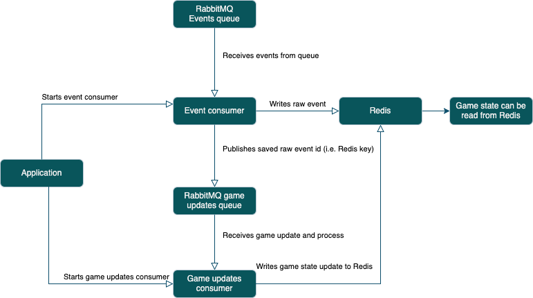

# Solution for Coding Challenge

I have implemented a game state handler for League of Legends that processes various events and calculates kill streaks and sprees. The implementation is designed to be expandable for future event types and is optimized for fast consumption of events.


## Architecture

The architecture consists of the following components:
- **RabbitMQ Queue**: This is the event source where incoming events are sent.
- **Event Listener**: This component consumes events from the RabbitMQ queue. It saves each event in Redis and pushes the Redis key to the Game State Updates queue.
- **Game Updates Handler**: This component consumes events from the Game State Updates queue. It reads related events from Redis, processes them, and updates the game state in Redis.
- **Redis**: This is used to store raw events, processed game state, and the final game state after the game ends.
- **Application**: This is the main application that initializes the event listener and game updates handler.




## Tests

All tests are located in the `tests` directory. The tests cover only killing streaks as required by the task. The tests are written using the `pytest` framework and can be run using the command:

```bash
make test
```

## Usage

To run the application, you need to have Docker, Docker Compose and Make installed. You can start the application using the following command:

```bash
make up
```

This will start the RabbitMQ queue and the application. You can run the whole scenario given in the task (events in `data` folder) using the following command. It will print the final game state to the console:

```bash
make run_scenario
```

## Redis data structure

The game state and related data are stored in Redis using a structured and hierarchical format. This allows for efficient access and updates during gameplay. Below is the detailed structure of how the data is organized in Redis:

- **General Game State** (`game:<match_id>`): Contains metadata and overall state of the game.
  - `match_id`: Unique identifier for the match.
  - `start_time`: Start time of the match.
  - `title`: Title of the match.
  - `series_current`: Current series number.
  - `series_max`: Maximum series number.
  - `series_type`: Type of the series.
  - `teams`: List of teams in the match and their players as nested JSON objects.
  - `first_blood`: First blood timestamp.

- **Team State** (`game:<match_id>:team:<team_id>`): Contains state information for a specific team.
  - `dragon_kills`: Number of dragon kills.
  - `tower_kills`: Number of tower kills.

- **Player State** (`game:<match_id>:player:<player_id>`): Contains state information for a specific player.
  - `player_id`: Unique identifier for the player.
  - `gold`: Number of gold coins.
  - `alive`: Is the player alive?
  - `name`: Name of the player.
  - `minion_kills`: Number of minion kills.
  - `human_kills`: Number of human kills.
  - `human_kills_assists`: Number of human kills assists.
  - `team_members`: List of team members in the match.

- **Player Kill History** (`game:<match_id>:player:<player_id>:kill_history`): A sorted set of player kill timestamps.

- **Player Death History** (`game:<match_id>:player:<player_id>:death_history`): A sorted set of player death timestamps.
